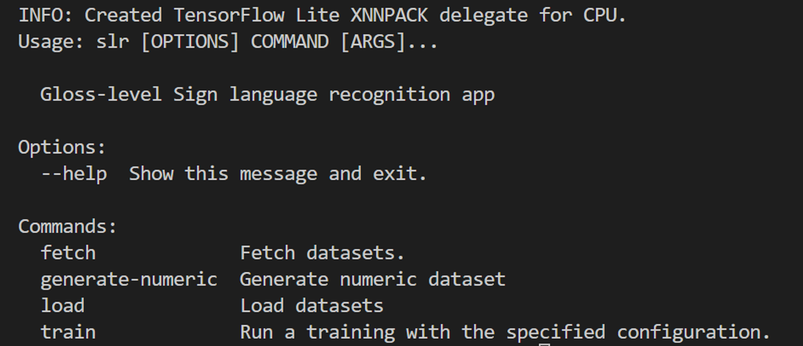
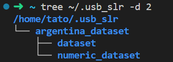
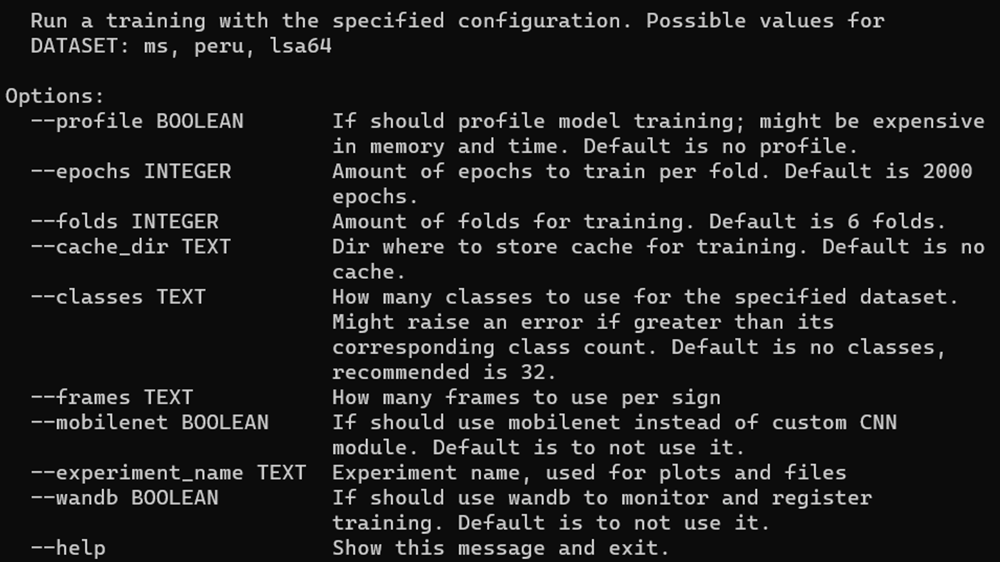

# Reconocimiento de lenguaje de señas aislado


En este repositorio se encuentra el código fuente de nuestro trabajo de tesis de grado en la Universidad Simón Bolívar. Para este proyecto se desarrolló un sistema de reconocimiento de lenguaje de señas aislado a nivel de _Gloss_. Dado un vídeo con una ejecución de una seña, se retorna la clase predicha para esta seña. El proceso consiste en extraer anotaciones esqueléticas para cada fotograma el video usando estimación de pose con [Mediapipe](https://mediapipe.dev), y luego representar la secuencia de grafos esqueléticos de dos formas distintas:

- Se define el **mapa de trayectoria**, una imagen que representa como una nube de puntos a los puntos de articulación a través del tiempo, marcando en colores cada parte de cuerpo. Las partes del cuerpo consideradas son: mano izquierda, mano derecha, y postura, que corresponde a los brazos, el torso, los hombros y algunos puntos en el rostro. 


- Se normalizan las posiciones de los puntos de articulación y se concatenan por frame creando un único vector que contiene a todos los demás. De esta forma, una seña consiste en una secuencia de estos vectores, que se concatenan de nuevo para formar una **matriz de características**.


Estas dos nuevas representaciones se pasan a un modelo de dos canales que procesa el mapa de trayectoria con un módulo CNN para obtener características espaciales, y la matriz de características con un módulo LSTM para obtener características temporales. Finalmente, el resultado de ambos módulos se procesa y se agrega usando la operación de promedio término a término.


## Entrenamiento
El entrenamiento se realizó con los conjuntos de datos: [MS-ASL](https://www.microsoft.com/en-us/download/confirmation.aspx?id=100121) (un subconjunto de 20/1000 clases), [LSA64](http://facundoq.github.io/datasets/lsa64/) (un subconjunto de 32/64 clases) y con un conjunto de datos de [Lenguaje de señas peruano](https://github.com/irvin1franco/peruvian-sign-language-legal-context). Se usó entrenamiento por _K Folds_ con k = 6, obteniendo los siguientes resultados:


Obteniendo los siguientes resultados:

El entrenamiento se realizó en una tarjeta gráfica Nvidia GeForce RTX 2060 de 6GB de RAM. 

## Instalación
La aplicación usa [Poetry](https://python-poetry.org) como manejador de paquetes, para instalarla es suficiente con clonar este repositorio, cambiar de directorio a la carpeta `usb_slr` y ejecutar el comando `poetry install`. Una vez termine el proceso de instalación, se habrá añadido un programa de línea de comandos `slr` que sirve para realizar operaciones comunes. También se puede importar como una librería para tener acceso a sus componentes individuales usando `import slr` desde Python. 

## Uso
La aplicación provista en este repositorio incluye una herramienta de línea de comandos que sirve como interfaz para operaciones comunes sobre las bases de datos, como cargar datos, procesarlos, y ejecutar un entrenamiento.

# Precondiciones

- Tener python 3.8 instalado
- Tener `poetry` , manejador de paquetes de python, instalado.
- Tener un manejador de _environments_ de python (como `virtualenvwrapper` )

# Instalación del proyecto

- Activa environment
- bajo `sign_language_recognition/usb_slr/` corre `poetry install` y espera que se instalen las dependencias

En cada ejecución sucesiva del proyecto se debe cargar el environment
<aside>
💡 Si se usa wsl hace falta instalar de forma global tkinter asi:

```bash
sudo apt-get install python3-tk
```

</aside>

# Consulta de información para el CLI

Usar `slr --help` , o su equivalente en cada sub comando (e.g. `slr fetch --help`) para consultar opciones adicionales:



<aside>
💡 Mostrar video

</aside>

# Descarga de datasets

Cada dataset debe descargarse (suelen venir en un zip) y se carga de la siguiente forma

```bash
slr load argentina-dataset $PATH_TO_ZIPFILE
```

<aside>
💡 Excepcion con MS-ASL. Este debe obtenerse utilizando la interfaz de linea de comando

</aside>

# Generacion de datasets numericos

Una vez descargado el dataset, deben generarse los datasets numericos que representan los mismos videos luego de la fase de **feature extraction** es decir, videos que representan secuencias de grafos esqueléticos.

```bash
slr generate-numeric argentina-dataset
```

<aside>
💡 Este es un proceso intensivo, el peso total del conjunto de datos numerico argentino es de 16 GB 

</aside>



- 

# Entrenamiento

El entrenamiento cuenta con las siguientes configuraciones y los valores por defecto mostrados.



Una corrida usual involucra lo siguiente:

```bash
# Crea un directorio de cache para el entrenamiento y resultados 
mkdir -p ~/.cache/usb_slr/argentinian_dataset/{train,results} 

# Empieza el entrenamiento
slr train --cache_dir ~/.cache/usb_slr/argentinian_dataset/train --experiment_name test_arg_dataset lsa64 ~/.cache/usb_slr/argentinian_dataset/results
```

De este modo, se correra el entrenamiento con la siguiente configuración 

| dataset | epocas | tamaño de lotes | numero de clases | directorio de cache | directorio de resultados | Nombre de experimentos |
| --- | --- | --- | --- | --- | --- | --- |
| argentino | 2000 | 32 | 32 | ~/.cache/usb_slr/argentinian_dataset/train | ~/.cache/usb_slr/argentinian_dataset/results | test_arg_dataset |